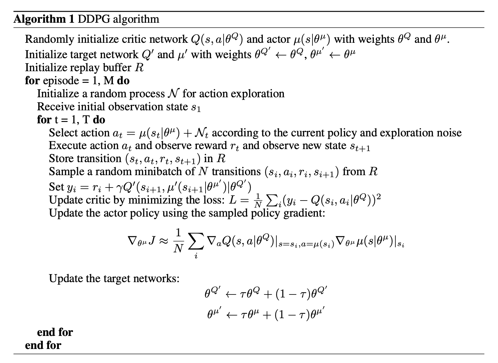
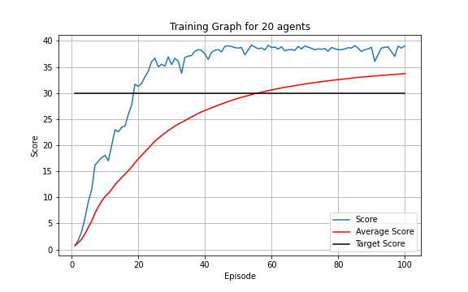

# <u>Continuous Control Report</u>

This project aims to control a double-jointed arm to follow a target moving within reach of the arm. The environment provided by [Unity](https://unity.com/), consists of a vector of 33 variables relating to the observation space and the position, rotation, velocity and angular velocities of the arm. The action space consists of 4 continuous action spaces ranging between [-1:1], which controls the torque of the 2 joints in the arm. A reward of +0.1 is given when the tip of the arm is in the correct location of the target, and a reward of 0.0 when not.

#### <u>Learning Algorithm</u>

A DDPG learning algorithm was used, which consists of 2 agents, an Actor and a Critic. The Actor is used to predict the outcome of a given state, and the Critic is used to estimate the q value using gradient ascent. Both networks also get a target network and uses a soft update. For more details on the implementation, refer to the paper [Continuous control with deep reinforcement learning](https://arxiv.org/abs/1509.02971) by Timothy P. et al. The following pseudocode also shows the basic structure of the implementation.

Reference: [Continuous control with deep reinforcement learning](https://arxiv.org/abs/1509.02971) by Timothy P. et al.

The Actor-Critic neural networks were compiled from the library [Pytorch](https://pytorch.org/) as follows:

<b>Actor Network:</b> The network consists of an input layer (taken from the state space), 2 hidden layers with [128,64] neurons, and a final output layer, which is a continuous action space of 4 values in the range of [-1:1]. Thereafter, noise was then added to the action space using an [Ornstein–Uhlenbeck](https://en.wikipedia.org/wiki/Ornstein%E2%80%93Uhlenbeck_process) noise process to engage exploration.

<b>Critic Network:</b> The network consists of an input layer (taken from the state space), 2 hidden layers with [128,64] neurons, and a final output layer which consists of a single neuron. The action state as predicted by the Actor is inserted into the first hidden layer.

<b>Experience Replay</b>
An Experience replay method was used to avoid correlations. The memory size used was 500000 with a replay size of 500.

Gradient clipping is also used to stabalise learning. Other hyperparameters used:
* gamma = 0.95
* tau = 0.01
* Update Frequency = 20
* Learning Steps = 25
* Actor Learning rate = 0.0001
* Critic Learning rate = 0.001

All code imports used can be found in the utils folder and consists of:

* actorCritic.py: The Neural Network setup for the Actor and Critic
* agent.py: The agent used to act, learn and update itself
* memoryReplay.py: Memory replay
* noise.py: Ornstein–Uhlenbeck process

#### <b>Result</u>

The environment successfully managed to achieve an average score of 30.99 within 100 episodes.

#### <u>Improvements</u>

Some improvements that could be considered:

- Adding noise to the weights and biases of the Actor-network instead of the actions as shown [here](https://openai.com/blog/better-exploration-with-parameter-noise/).
- Normalizing the rewards.
- Use a [Distributed Distributional Deterministic Policy Gradients (D4PG)](https://openreview.net/forum?id=SyZipzbCb) 

